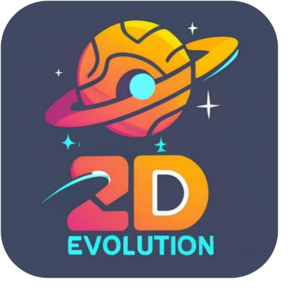
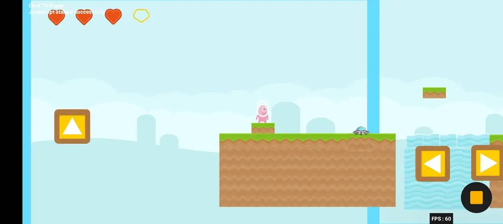
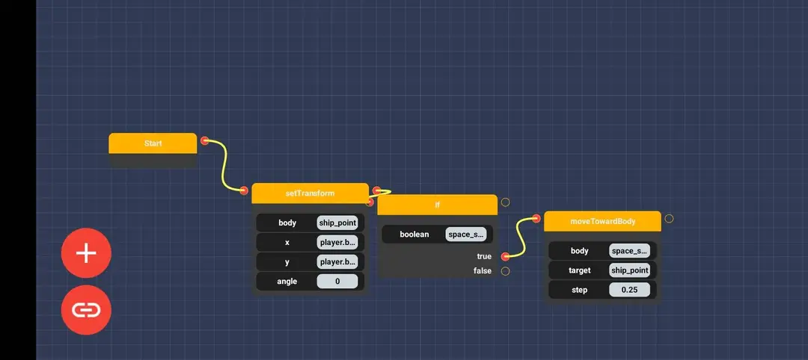
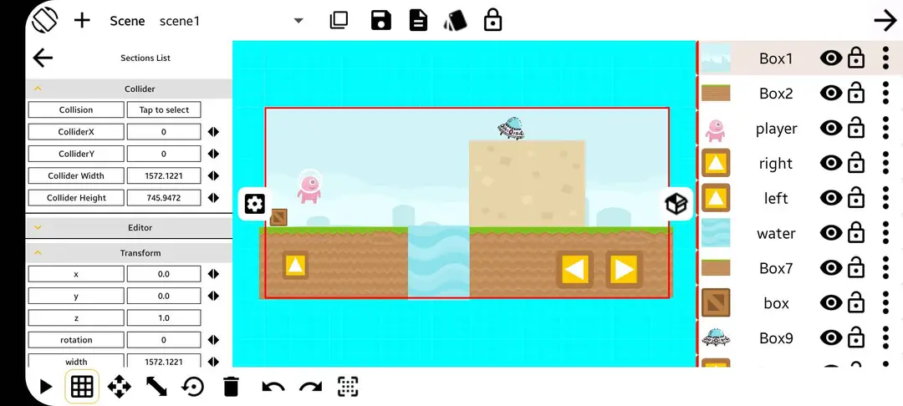
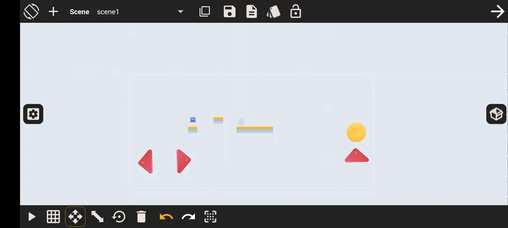

  

  # Star2D
  Star2D is a game engine developed for Android.

  Hello everyone, very busy nowadays, but I like this project very much 💕. Thanks to everyone supporting me while developing it.

  **Why is Star2D special?**  
  Star2D is a very simple engine, made by a simple developer, with simple tools, and 0 benefits.  
  My goal with this project is to create a game engine that works well on mobile devices, with an interactive UI/UX and smooth gameplay.

  After working several months on this project, I've implemented many features like the **CodeGenerator**, which generates clear code (still needs improvement) instead of just random stuff.

  I'm interested in developing game engines, but unfortunately, I lack time and experience. Star2D is missing some core logic! I know I should use OpenGL or at least LibGDX to make it work on other platforms, but it's hard when working alone.

  *Please help me update this engine and contribute! Even simple work is appreciated.*
  - Create a UI
  - Create a game
  - Write an article

## Features

- [x] World-Designer
- [x] Auto-code-completion
- [x] Visual Scripting (Node System)
- [x] Physics engine (Box2D)
- [x] APK export
- [ ] Sprite Sheet Cutter
- [ ] TileMap Editor

  
  
  
  

## The New Custom Collision Shape Maker

## Want to Write Code?

> [!Note]
> Please read [note.txt](https://github.com/abodinagdat16/Star2D/blob/master/assets/note.txt).  
> You can use our project and modify the code, but you must include a notice attributing the original source.

> [!Caution]
> We added some bugs to the engine 🚒.
